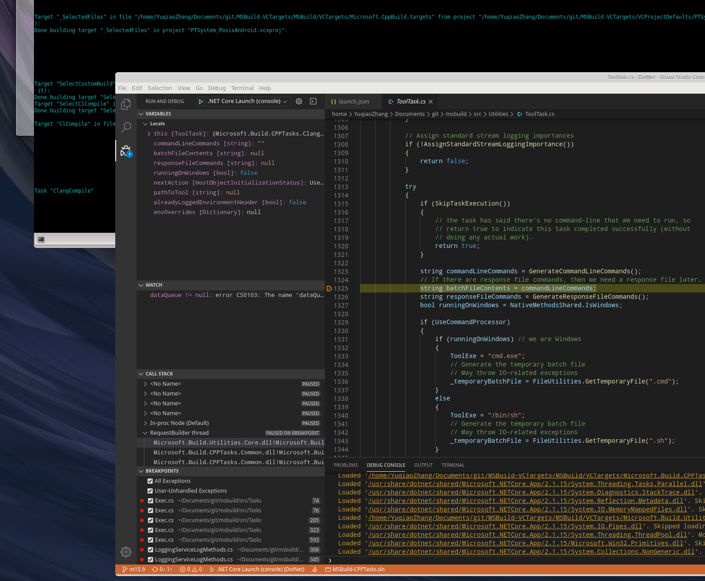

## Building
Install the [DotNet Core SDK](https://docs.microsoft.com/en-us/dotnet/core/install/linux-package-manager-centos7#install-the-net-core-sdk) and use the [MSBuild](https://github.com/microsoft/msbuild/blob/master/documentation/wiki/Building-Testing-and-Debugging-on-.Net-Core-MSBuild.md#getting-net-core-msbuild-binaries-without-building-the-code) to build the c# projects.  
  
You can use the following command to build the c# projects.  
  
```  
cd /*root of this git repository*/
dotnet build ./DotNet/Microsoft.Build.Utilities.Extension/Microsoft.Build.Utilities.Extension.csproj  -property:Configuration=Debug -property:Platform=AnyCPU
dotnet build ./DotNet/Microsoft.Build.CPPTasks.Common/Microsoft.Build.CPPTasks.Common.csproj  -property:Configuration=Debug -property:Platform=AnyCPU
dotnet build ./DotNet/Microsoft.Build.CPPTasks.Android/Microsoft.Build.CPPTasks.Android.csproj  -property:Configuration=Debug -property:Platform=AnyCPU

```  
  
Use the [Apache NetBeans](https://github.com/YuqiaoZhang/EL7-RPMS/tree/master/netbeans) to build the C++ projects.  
  
You may use the **Apache NetBeans** to open the CPP/Tracker folder and then press **the build button in the UI** to build  
You may use the [LLVM Tool Chain](https://github.com/YuqiaoZhang/EL7-RPMS/tree/master/llvmtoolchain) prebuilt by me.  
  
## Debugging  
You may use the [Visual Studio Code with the C# extension](https://code.visualstudio.com/docs/languages/dotnet) to debug and I have prepared the **json files**(in the DotNet/.vscode) for you.  
The breakpoints may not be hit if you use the **MSBuild in DotNet Core SDK**(in the /usr/share/dotnet/sdk/2.1.803/MSBuild.dll) for debugging.  
You may need to build another [MSBuild](https://github.com/microsoft/msbuild/blob/master/documentation/wiki/Building-Testing-and-Debugging-on-.Net-Core-MSBuild.md#build-1) with the **Debug configuration** for debugging.  
You may need to install the [libssl1.0.0](https://github.com/YuqiaoZhang/EL7-RPMS/tree/master/openssl) before build the **MSBuild** if you use the **CentOS 7** platform.  

  

## Core architecture and organization  

### C# Projects  
Nothing to talk about.  
  
### File Tracker  
  
#### Functionality  
In [CPP/Tracker/Tracker.pdf](CPP/Tracker/Tracker.pdf):  
File Tracker, as the name implies, tracks read and write accesses to files made by a process.  
Most of the Visual C++ tools, such as cl.exe and link.exe, are run in their own separate processes by the corresponding tasks.   
The tool tasks don’t create the tool process directly. They create the File Tracker executable—the Tracker.exe process—and hand over the responsibility of executing the tool to it.  
File Tracker wraps these tool processes and keeps track of all the files read by and written to by the ­process (and any other process it spawns) in a lightweight manner.  
This eavesdropping means that **MSBuild doesn’t have to depend on the user supplying the list of inputs and outputs that a task consumes**.  
File Tracker then **writes the list of these file paths in tracking log files** (with the
­extension .tlog) in the project’s intermediate directory. Tlog files are in a human-readable
format although in the normal course of events, the only reason that you should ever need to look at the log files themselves is to satisfy your curiosity.  
When a task is scheduled to run during an incremental build, MSBuild compares the ­timestamp-on-disk for the input files to the timestamp-on-disk for the output files. A set of input and output files is judged to be up to date if the oldest output is newer than the ­newest input. If the set of files is not up to date, the task is run; otherwise, it is not.  
Notice that we only used timestamps on disk for checking the up-to-date status. Because of this, **no timing information is ever written to the tlog files**.  
  
[TrackedVCToolTask::TrackerExecuteTool](DotNet/Microsoft.Build.CPPTasks.Common/src/CPPTasks/TrackedVCToolTask.cs) invokes [ToolTask::ExecuteTool](https://docs.microsoft.com/en-us/dotnet/api/microsoft.build.utilities.tooltask) to execute tje track.exe and pass the command arguments to it.  
  
[TrackedVCToolTask::ComputeOutOfDateSources](DotNet/Microsoft.Build.CPPTasks.Common/src/CPPTasks/TrackedVCToolTask.cs) use [CanonicalTrackedInputFiles](https://docs.microsoft.com/en-us/dotnet/api/microsoft.build.utilities.canonicaltrackedinputfiles.computesourcesneedingcompilation) and [CanonicalTrackedOutputFiles](https://docs.microsoft.com/en-us/dotnet/api/microsoft.build.utilities.canonicaltrackedoutputfiles) to interpret the tlog files and the code may imply the format of tlog files.  

####  Implementation  
In [CPP/Tracker/Tracker.pdf](CPP/Tracker/Tracker.pdf):  
File Tracker achieves this by detouring ­several Win32 file access application programming interface (API) calls such as CreateFile and CopyFile, recording the access, and then passing on the call to the ­operating system normally.  

There are some open source projects for reference:  
[renderdoc](https://github.com/baldurk/renderdoc/tree/v1.x/renderdoc/renderdoc/hooks/hooks.h)  
[Mach-O-Hook](https://github.com/YuqiaoZhang/Mach-O-Hook)  
[strace](https://github.com/strace/strace)  


